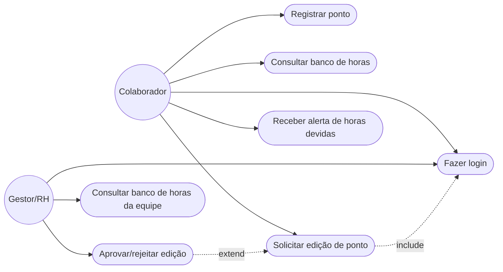
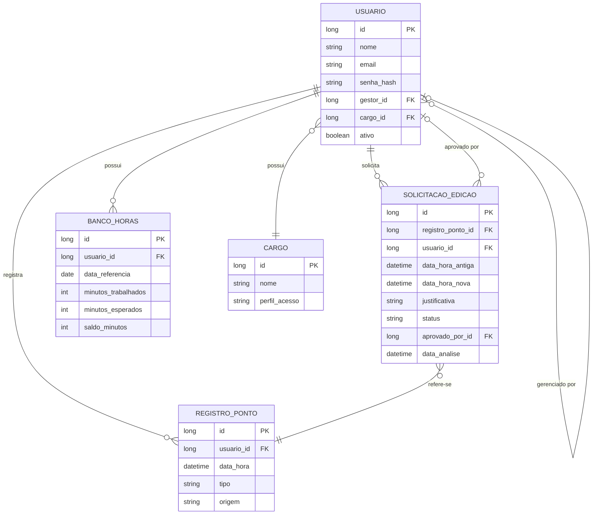
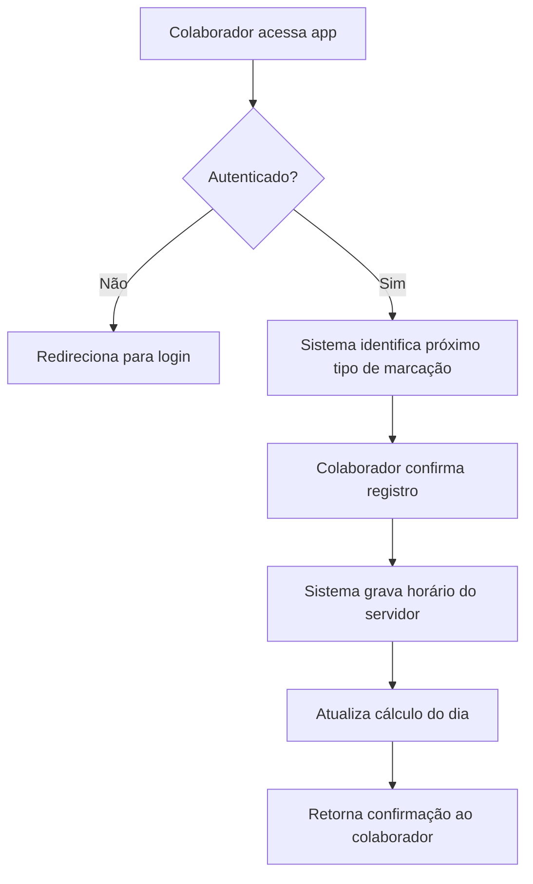
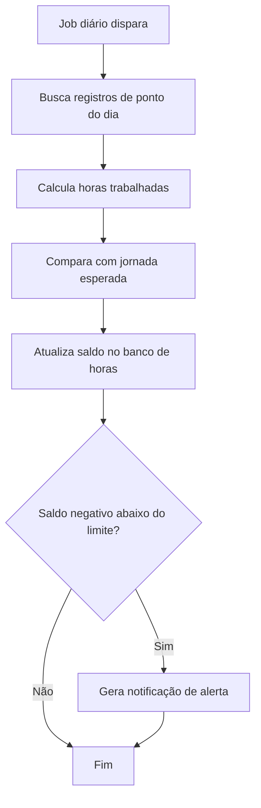
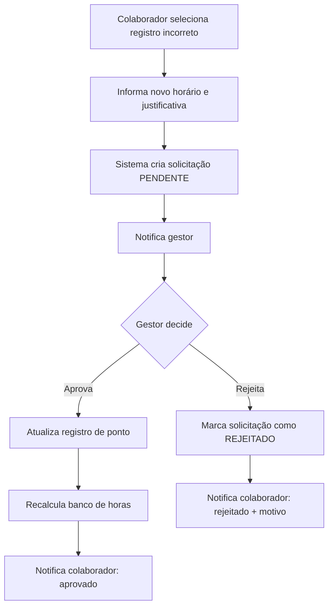

# Sistema de Ponto Eletrônico — Documentação do Projeto

**Versão:** 1.0
**Autor:** Gabriel
**Finalidade:** Projeto de portfólio / estudo — simulação de um sistema real de controle de jornada de trabalho.

---

## 1. Visão Geral

Aplicação para controle de jornada de trabalho (bater ponto), com cálculo automático de banco de horas, alertas de horas devidas e possibilidade de correção/edição de registros com fluxo de aprovação.

O objetivo deste documento é servir de referência técnica para a construção do sistema, cobrindo requisitos, casos de uso, modelagem de dados e fluxos de processo — o material que normalmente acompanha um sistema corporativo real.

### 1.1 Objetivos do sistema

- Permitir que o colaborador registre entrada, saída e intervalos.
- Calcular automaticamente as horas trabalhadas por dia/período.
- Manter um banco de horas (saldo positivo ou negativo) por colaborador.
- Notificar o colaborador quando estiver devendo horas.
- Permitir solicitação de ajuste/edição de um ponto batido incorretamente, com aprovação do gestor.
- Fornecer visão gerencial (para o gestor/RH) do banco de horas da equipe.

### 1.2 Fora de escopo (v1)

- Integração com folha de pagamento.
- Geolocalização / biometria.
- Múltiplas empresas (multi-tenant) — pode ser trabalho futuro.

---

## 2. Atores

| Ator | Descrição |
|---|---|
| **Colaborador** | Usuário comum, registra os próprios pontos e visualiza seu banco de horas. |
| **Gestor/RH** | Aprova ou rejeita solicitações de edição de ponto, visualiza banco de horas da equipe. |
| **Sistema** | Executa cálculos automáticos (banco de horas, alertas) e envia notificações. |

---

## 3. Casos de Uso

### 3.1 Diagrama de Casos de Uso



### 3.2 Especificação dos casos de uso

#### UC01 — Fazer login
- **Ator:** Colaborador, Gestor
- **Pré-condição:** Usuário cadastrado no sistema.
- **Fluxo principal:**
  1. Usuário informa e-mail/matrícula e senha.
  2. Sistema valida credenciais.
  3. Sistema autentica e redireciona para a tela inicial (dashboard).
- **Fluxo alternativo:** Credenciais inválidas → sistema exibe mensagem de erro e permite nova tentativa.

#### UC02 — Registrar ponto
- **Ator:** Colaborador
- **Pré-condição:** Usuário autenticado.
- **Fluxo principal:**
  1. Colaborador acessa a tela de registro de ponto.
  2. Sistema captura data/hora atual do servidor.
  3. Colaborador confirma o registro (entrada, início/fim de intervalo, ou saída).
  4. Sistema grava o registro vinculado ao colaborador.
- **Regra de negócio:** A sequência esperada é Entrada → Início Intervalo → Fim Intervalo → Saída. O sistema deve identificar automaticamente qual é o próximo tipo de marcação esperado.

#### UC03 — Consultar banco de horas
- **Ator:** Colaborador
- **Fluxo principal:**
  1. Colaborador acessa "Meu banco de horas".
  2. Sistema exibe saldo atual (positivo/negativo) e histórico por dia/período.

#### UC04 — Solicitar edição de ponto
- **Ator:** Colaborador
- **Pré-condição:** Existe um registro de ponto lançado incorretamente.
- **Fluxo principal:**
  1. Colaborador seleciona o registro a corrigir.
  2. Informa o novo horário e uma justificativa.
  3. Sistema cria uma solicitação de edição com status "Pendente".
  4. Notifica o gestor responsável.
- **Regra de negócio:** O registro original não é sobrescrito até a aprovação — mantém-se histórico de auditoria.

#### UC05 — Receber alerta de horas devidas
- **Ator:** Sistema → Colaborador
- **Disparo:** Job periódico (ex.: diário) calcula o saldo do banco de horas.
- **Fluxo principal:**
  1. Sistema verifica se o saldo está negativo (abaixo de um limite configurável).
  2. Se sim, gera notificação para o colaborador.

#### UC06 — Aprovar/rejeitar edição de ponto
- **Ator:** Gestor/RH
- **Pré-condição:** Existe solicitação de edição pendente.
- **Fluxo principal:**
  1. Gestor visualiza a solicitação (valor antigo, valor novo, justificativa).
  2. Gestor aprova ou rejeita.
  3. Se aprovado: sistema atualiza o registro de ponto e recalcula o banco de horas.
  4. Se rejeitado: solicitação é arquivada com o motivo.

#### UC07 — Consultar banco de horas da equipe
- **Ator:** Gestor/RH
- **Fluxo principal:**
  1. Gestor acessa painel gerencial.
  2. Sistema lista colaboradores da equipe com seus respectivos saldos.

---

## 4. Requisitos

### 4.1 Requisitos Funcionais

| ID | Descrição |
|---|---|
| RF01 | O sistema deve permitir login com e-mail e senha. |
| RF02 | O sistema deve permitir registrar entrada, intervalo e saída. |
| RF03 | O sistema deve calcular automaticamente as horas trabalhadas por dia. |
| RF04 | O sistema deve manter um banco de horas acumulado por colaborador. |
| RF05 | O sistema deve notificar o colaborador quando o saldo estiver negativo. |
| RF06 | O sistema deve permitir solicitar edição de um ponto já registrado. |
| RF07 | O sistema deve exigir aprovação do gestor para efetivar uma edição. |
| RF08 | O sistema deve manter histórico de todas as alterações (auditoria). |
| RF09 | O gestor deve poder visualizar o banco de horas de todos os colaboradores da sua equipe. |

### 4.2 Requisitos Não Funcionais

| ID | Descrição |
|---|---|
| RNF01 | O horário do ponto deve ser sempre obtido do servidor, nunca do cliente (evitar fraude). |
| RNF02 | Senhas devem ser armazenadas com hash (ex.: BCrypt). |
| RNF03 | O sistema deve responder às requisições de registro de ponto em até 1s. |
| RNF04 | Autenticação via token (JWT) para a API. |
| RNF05 | Logs de auditoria não podem ser apagados. |

---

## 5. Modelo de Dados

### 5.1 Diagrama Entidade-Relacionamento



### 5.2 Dicionário de dados (resumo)

**USUARIO**
- `tipo` de perfil vem de `CARGO.perfil_acesso` (ex.: COLABORADOR, GESTOR, ADMIN).
- `gestor_id` é auto-relacionamento (um usuário aponta para seu gestor).

**REGISTRO_PONTO**
- `tipo`: ENTRADA, INICIO_INTERVALO, FIM_INTERVALO, SAIDA.
- `origem`: WEB, APP, AJUSTE_MANUAL — importante para auditoria.

**BANCO_HORAS**
- Um registro por colaborador/dia (ou pode ser agregado por período, dependendo da granularidade escolhida).
- `saldo_minutos` = `minutos_trabalhados` − `minutos_esperados`.

**SOLICITACAO_EDICAO**
- `status`: PENDENTE, APROVADO, REJEITADO.

---

## 6. Fluxogramas

### 6.1 Fluxo — Registrar Ponto



### 6.2 Fluxo — Cálculo de Banco de Horas e Alerta



### 6.3 Fluxo — Solicitação e Aprovação de Edição



---

## 7. Arquitetura Proposta

Como você já trabalha com Java/Spring Boot, a sugestão de arquitetura segue o mesmo padrão em camadas:

```
com.gabriel.pontoapp
 ├── config          (segurança, JWT, CORS)
 ├── controller       (endpoints REST)
 ├── dto              (objetos de entrada/saída da API)
 ├── model            (entidades JPA)
 ├── repository       (interfaces Spring Data JPA)
 ├── service          (regras de negócio: cálculo de horas, aprovação)
 ├── exception        (tratamento de erros customizados)
 └── scheduler        (job diário de cálculo de banco de horas / alertas)
```

**Stack sugerida:**
- Backend: Java + Spring Boot + Spring Security (JWT) + Spring Data JPA
- Banco de dados: PostgreSQL
- Frontend: React ou Angular (ou app mobile, se preferir simular o caso de uso real de "bater ponto pelo celular")
- Documentação de API: Swagger/OpenAPI

---

## 8. Regras de Negócio — Resumo

1. Horário sempre obtido do servidor, nunca enviado pelo cliente.
2. Sequência de marcações validada (não pode bater "saída" sem "entrada" antes).
3. Edição de ponto nunca altera o registro original diretamente — passa por aprovação.
4. Banco de horas recalculado sempre que um registro aprovado é alterado.
5. Alerta de horas devidas disparado quando saldo < limite configurável (ex.: -2h).

---

## 9. Possíveis Evoluções (Roadmap)

- App mobile com geolocalização.
- Relatórios exportáveis (PDF/Excel) do banco de horas.
- Regras de jornada diferenciadas por cargo (escala 6x1, 5x2, etc).
- Multi-empresa (multi-tenant).
- Dashboard analítico para RH.
